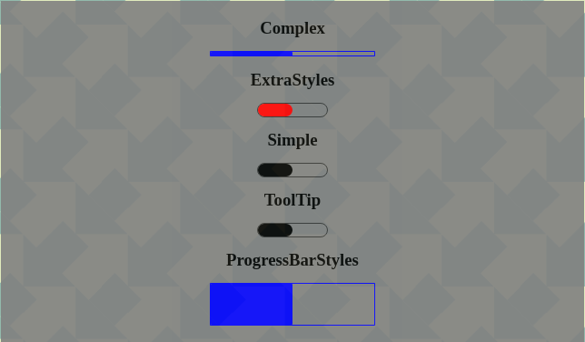

# progress_bar_for_react

> Made with Vite

[](https://www.npmjs.com/package/progress_bar_for_react) [](https://standardjs.com)
[](http://www.typescriptlang.org/)

## Install

```bash
npm install --save progress_bar_for_react
```

This is a simple fully customizable react progress bar component



### Author

Myron Apostolakis

### Installation

- `npm install --save progress_bar_for_react`

### Import

Since the latest version (1.0.43) the import directive has changed from

`import ProgressBar from "progress_bar_for_react";`

to

`import { ProgressBarContainer as ProgressBar } from 'progress_bar_for_react';`

Please feel free to update your code accordingly.

### Usage

`<ProgressBar percentage={50} />`

The option `percentage` is mandatory in order for the ProgressBar to display. When the percentage is equal to 100% the ProgressBar will hide itself.

### List of supported Options

| Option                         | Description                                                                                                    |
| ------------------------------ | -------------------------------------------------------------------------------------------------------------- |
| tooltip='Demo text'            | If this option is set then the 'Demo text' appears as a tooltip on mouse hovering                              |
| fillerExtraStyles={{...}}      | Filler extra styles will override the default styling. Usage: backgroundColor: blue or hex code                |
| progressBarExtraStyles={{...}} | Progress Bar extra styles will override the default styling. Usage: position,height,width,borderRadius, border |

Please see the **src/Examples** folder for more descriptive usage.

### API calls

`onPercentageChange`

It will be triggered when a new percentage is received. Please see examples

### Fork instructions

You can fork this repository for your own modifications following the bellow steps

Please follow the instructions from `https://help.github.com/en/github/getting-started-with-github/fork-a-repo`

### Development - Storybook

Use command `npm run storybook` and visit `http://localhost:6006`.
You can view the storybook online [here](https://622e55013e5eac003a9669be-gnobmxhwps.chromatic.com/?path=/story/progress-bar--simple)

### Testing

This component is tested using Cypress and Vite Server

You can use the following commands

- `npm test` to run vite dev server and cypress in browser mode.
- `npm run test:headless` to run vite dev server and cypress in headless mode.

### License

This repo is licensed under GNU General Public License v3.0

### Tutorial

A short tutorial can be found in the following link
[https://codebitshub.com/progress_bar_for_react](https://codebitshub.com/progress_bar_for_react)

### Changelog

- v1.0.59 --> Added Typescript support, build with Vite
- v1.0.55 --> Tested with React 18
- v1.0.52 --> Replaced react-jss with emotion
- v1.0.51 --> Tested with node version > 16.13.1
- v1.0.45 --> Removed third party dependency of `react-tooltip` package
