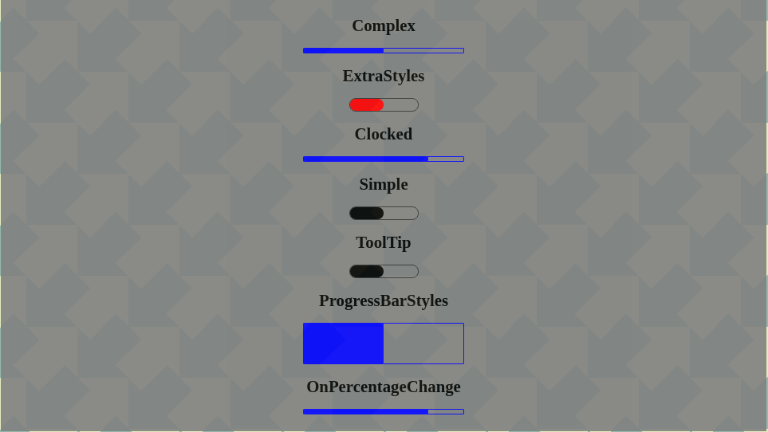

# progress-bar-for-react

This is a simple fully customizable react progress bar component

### Author

Myron Apostolakis

### Installation

- `npm install --save progress_bar_for_react`

### Import

`import ProgressBar from "./ProgressBar";`

### Usage

`<ProgressBar percentage={50} />`

The option `percentage` is mandatory in order for the ProgressBar to display. When the percentage is equal to 100% the ProgressBar will hide itself.

### List of supported Options

| Option                         | Description                                                                                                    |
| ------------------------------ | -------------------------------------------------------------------------------------------------------------- |
| tooltip='Demo text'            | If this option is set then the 'Demo text' appears as a tooltip on mouse hovering                              |
| fillerExtraStyles={{...}}      | Filler extra styles will override the default styling. Usage: backgroundColor: blue or hex code                |
| progressBarExtraStyles={{...}} | Progress Bar extra styles will override the default styling. Usage: position,height,width,borderRadius, border |

Please see the **src/Examples** folder for more descriptive usage.

### API calls

`onPercentageChange`

It will be triggered when a new percentage is received. Please see examples

### Demo

You can see a demo in the following [link](https://myapos.github.io/progress-bar-for-react/)

### Fork instructions

You can fork this repository for your own modifications following the bellow steps

Please follow the instructions from `https://help.github.com/en/github/getting-started-with-github/fork-a-repo`

### Development

Use command `npm start` and visit `http://localhost:2222`. Every example in the Examples folder will load.

### Build

Use command `npm run dist:demo`

### Storybook

Use command `npm run storybook`

### Codesandbox

- [Simple](https://codesandbox.io/s/green-shadow-3370g?file=/src/Simple.js)
- [Extra Styles](https://codesandbox.io/s/compassionate-sara-friwc?file=/src/App.js)
- [Complex](https://codesandbox.io/s/compassionate-firefly-ofstl?file=/src/App.js)
- [ProgressBarStyles](https://codesandbox.io/s/practical-sanne-zidqd?file=/src/App.js)
- [ToolTip](https://codesandbox.io/s/winter-silence-30mox?file=/src/App.js)
- [ClockedProgressBar](https://codesandbox.io/s/intelligent-taussig-19iz0?file=/src/App.js)

### License

This repo is licensed under GNU General Public License v3.0

### Testing and Code coverage

THis project is tested with Cypress with two ways. The first one is the combination of cypress and storybook. The storybook is the application that is loaded and used to navigate between stories. There is an
issue with this approach related to coverage.Since the storybook is loaded inside iframes the code cannot be instrumented properly in order to produce the code coverage report through the window.**coverage** variable.
Basically it is used as a quick testing local tool.

The second approach uses the dev server which loads every example and navigates between them. Then the coverage report is generated normally.

### TODO

- Add CI/CD with CircleCI
